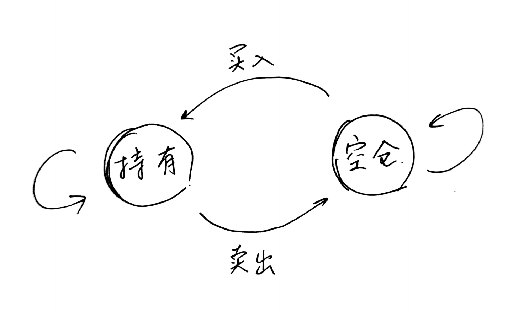
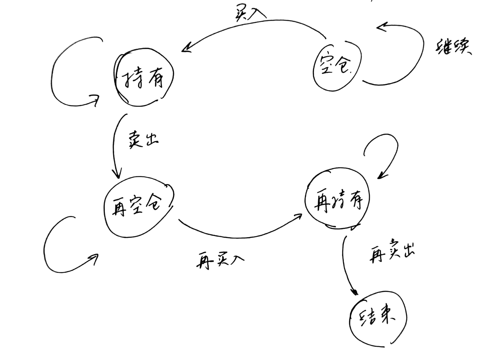
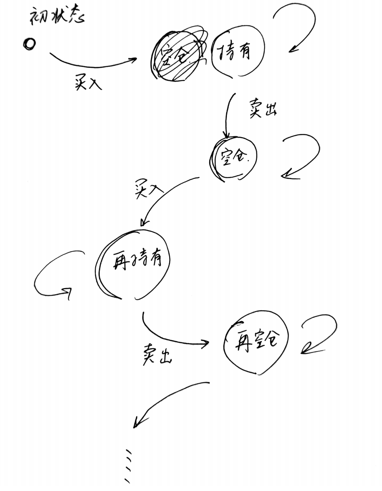
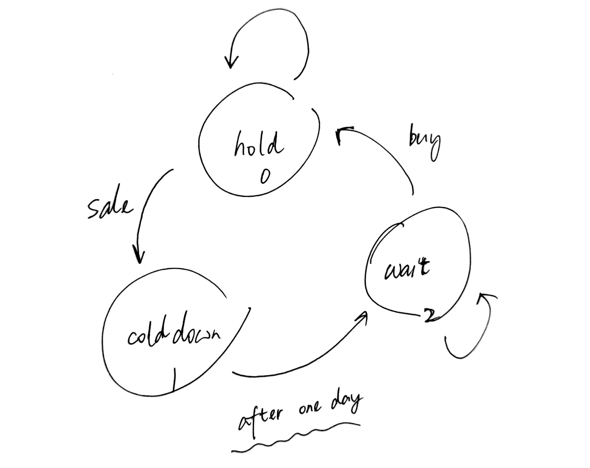

>  本文不全参照同文件夹下的《LeetCode 买卖股票的最佳时机》即[CSDN博文](https://blog.csdn.net/weixin_44413191/article/details/106346918)。


涉及到的Leetcode 题目：

- [121.买卖股票的最佳时机](https://leetcode-cn.com/problems/best-time-to-buy-and-sell-stock/)
- [122.买卖股票的最佳时机 II](https://leetcode-cn.com/problems/best-time-to-buy-and-sell-stock-ii/)
- [123.买卖股票的最佳时机 III](https://leetcode-cn.com/problems/best-time-to-buy-and-sell-stock-iii/)
- [188.买卖股票的最佳时机 IV](https://leetcode-cn.com/problems/best-time-to-buy-and-sell-stock-iv/)
- [309.最佳买卖股票时机含冷冻期](https://leetcode-cn.com/problems/best-time-to-buy-and-sell-stock-with-cooldown/)
- [714.买卖股票的最佳时机含手续费](https://leetcode-cn.com/problems/best-time-to-buy-and-sell-stock-with-transaction-fee/)
- [剑指 Offer 63. 股票的最大利润](https://leetcode-cn.com/problems/gu-piao-de-zui-da-li-run-lcof/)（与121题相同）


总的来说，这一系列题目用到的知识是**动态规划**和**有限状态机**，先画出状态转移图，根据图确定如何从子问题的解得到当前问题的解。

### 121题：只能交易一次（k=1）

状态转移图可以画成如下：


存在两个状态，一个是持有股票，一个是不持有股票。

当买入股票的时候，总的资金量要减去当前的股票价格；当卖出股票的时候，总的资金量要加上当前的股票价格。

其实就是要找到最低的价格来买入，然后在价格最高的时候卖出。其实用不到状态转移，但是也可以通过状态转移与后面四道题统一到同一个模板下。具体到代码上，在122题

```c++
class Solution {
public:
    int maxProfit(vector<int>& prices) {
        int  ans = 0, len = prices.size();
        if(len == 0) return ans;

        int dp[len][2];
        dp[0][0] = 0-prices[0];     // 持有股票
        dp[0][1] = 0;               // 不持有股票
        for(int i = 1; i < len; i++){
            dp[i][0] = max(dp[i-1][0], 0 - prices[i]);	// 本质上更新的是当前的最低价格
            dp[i][1] = max(dp[i-1][1], dp[i-1][0] + prices[i]);	// 本质上更新的是最大价格差
            if(dp[i][1] > ans) ans = dp[i][1];
        }
        return ans;
    }
};
```

### 122题：可以交易无数次（k=+∞）

这个题反倒是比上一题要更容易理解一些，因为这个是涉及到了完整的状态转移，如下图所示：



这里也是两个状态，持有股票状态和空仓状态。

对应这两个状态，dp数组可以设置为```dp[len][2]```。用```dp[i][0]```表示在第i天持有股票的情况下的资金状况，用```dp[i][1]```表示在第i天空仓的情况下的资金状况。

具体到状态转移上：

1. 如果在第i天持有股票的话，此时的最优解应该是在 **第i-1天的持有股票时的最优价解（即第i-1天不卖出）** 和 **第i-1天空仓时买入股票** 这两种情况中最大的值。如上图中，圆圈“持有”有两个指入的箭头，一个是上一个状态的持有，一个是上一个状态的空仓并买入股票。

2. 如果在第i天空仓的话，此时的最优解应该是在 **第i-1天的空仓时的最优解（即第i-1天不买入股票）** 和 **第i-1天持有股票后卖出** 这两种情况中的最大值。如上图中，圆圈“空仓”有两个指入的箭头，一个是上一个状态的空仓，一个是上一个状态的持有并卖出股票。

下面的代码更加直观地给出了这一状态转移过程。

```c++
class Solution {
public:
    int maxProfit(vector<int>& prices) {
        int  ans = 0, len = prices.size();
        if(len == 0) return ans;

        int dp[len][2];
        dp[0][0] = 0-prices[0];     // 持有股票
        dp[0][1] = 0;               // 不持有股票
        // 持有股票 --卖出股票--> 不持有股票，在卖出股票的过程中，获得收益
        // 不持有股票 --买入股票--> 持有股票
        for(int i = 1; i < len; i++){
            dp[i][0] = max(dp[i-1][0], dp[i-1][1]-prices[i]);
            dp[i][1] = max(dp[i-1][1], dp[i-1][0] + prices[i]);
        }
        return dp[len-1][1];
    }
};
```

但我们可以看到上面代码中的一个问题，就是dp数组占用了O(n)的空间，但是实际上，我们每次计算的时候不需要知道那么多之前的状态，我们只需要知道之前一天的状态情况，所以这里可以进一步将空间复杂度优化到O(1)。代码如下：

```c++
class Solution {
public:
    int maxProfit(vector<int>& prices) {
        int  ans = 0, len = prices.size();
        if(len == 0) return ans;

        int dp0 = 0-prices[0];     // 持有股票
        int dp1 = 0;               // 不持有股票
        // 持有股票 --卖出股票--> 不持有股票，在卖出股票的过程中，获得收益
        // 不持有股票 --买入股票--> 持有股票
        for(int i = 1; i < len; i++){
            int temp = dp0;
            dp0 = max(dp0, dp1-prices[i]);
            dp1 = max(dp1, temp + prices[i]);
        }
        return dp1;
    }
};
```

这里用两个变量来存储当前两个状态的情况，在循环的过程中，用一个temp来存储中间值。

### 123题：最多两次交易（k=2）




这个题参照121题，可以将所有的状态穷举出来，如图中所示，可以找到持有、再空仓、再持有、卖出这样四种状态。

```c++
// 这里可以直接穷举出来四个状态：
// 0. 空仓
// 1. 持有
// 2. 再空仓
// 3. 再持有
// 4. 卖出结束 这一步可以不用单独记录下来
class Solution {
public:
    int maxProfit(vector<int>& prices) {
        int len = prices.size();
        if(len == 0) return 0;
        
        int dp[len][4];
        // 初始化状态
        dp[0][0] = 0 - prices[0];   // 持有
        dp[0][1] = 0;               // 空仓
        dp[0][2] = 0 - prices[0];   // 再持有。 ！！！！！！这里需要注意，再持有的时候，不能初始化为0
        dp[0][3] = 0;               // 再空仓
        // 开始后续的状态转移
        for(int i = 1; i < len; i++){
            dp[i][0] = max(dp[i-1][0], 0 - prices[i]);
            dp[i][1] = max(dp[i-1][1], dp[i-1][0] + prices[i]);
            dp[i][2] = max(dp[i-1][2], dp[i-1][1] - prices[i]);
            dp[i][3] = max(dp[i-1][3], dp[i-1][2] + prices[i]);
        }
        return dp[len-1][3];
    }
};
```

这里要注意的是，初始化时，持有的状态都还是让其先买入第一天的股票，不能初始化为0，不然后面经过max这个操作不会对其产生影响。同时这样可以使得即便是通过一次交易得到了最大值，也可以在第二次交易的最终结果中得到（相当于第一次交易没有发生，第二次交易就是唯一的一次交易）。

这一部分代码同样也可以优化时间复杂度，方法与上面相似，这里不再赘述了。

### 188题：最多完成k次交易（k=any number）




思路其实是123题的一个泛化，在123题中，我们穷举了买两次股票的情况，在这里将该方法迁移到买k次股票。

```c++
class Solution {
public:
    int maxProfit_infi(vector<int>& prices) {
        int  ans = 0, len = prices.size();
        if(len == 0) return ans;

        int dp[len][2];
        dp[0][0] = 0-prices[0];     // 持有股票
        dp[0][1] = 0;               // 不持有股票
        // 持有股票 --卖出股票--> 不持有股票，在卖出股票的过程中，获得收益
        // 不持有股票 --买入股票--> 持有股票
        for(int i = 1; i < len; i++){
            dp[i][0] = max(dp[i-1][0], dp[i-1][1]-prices[i]);
            dp[i][1] = max(dp[i-1][1], dp[i-1][0] + prices[i]);
        }
        return dp[len-1][1];
    }
    int maxProfit(int k, vector<int>& prices) {
        int len = prices.size();
        if(!len || !k) return 0;
        // 用之前做过的无数多次交易的来优化k特别大的情况，如果不做优化确实会爆栈以及超时
        // 因为题目的条件中k都能到10^9了
        if (k > len / 2) return maxProfit_infi(prices);
        // 初始化状态
        int dp[k][2];
        for(int i = 0; i < k; i++){
            dp[i][0] = -prices[0];
            dp[i][1] = 0;
        }
        for(int i = 1; i < len; i++){
            for(int j = k-1; j > 0; j--){
                dp[j][1] = max(dp[j][1], dp[j][0] + prices[i]);
                dp[j][0] = max(dp[j][0], dp[j-1][1] - prices[i]);
            }
            dp[0][1] = max(dp[0][1], dp[0][0] + prices[i]);
            dp[0][0] = max(dp[0][0], 0 - prices[i]);
        }
        return dp[k-1][1];
    }
};
```

与之前的题解一样，这里也优化了空间复杂度。

如果直接按照上述的思路书写代码，提交以后在某些测试点会爆栈，结果才注意到题目给的k的范围是$[0, 10^9]$ 所以当k非常大的时候，确实会爆栈。然后就做了一个优化，当 k > len/2的时候，最多也只能做len/2次交易。就在这里取 k = min ( len/2, k)。

这样修改以后提交以后会报超时的错误。仍需要继续优化，想到如果k的大小非常大的时候，就可以直接看成是无穷多次交易。做无穷多次交易的时间复杂度只有O(n)，而这个时候如果依旧调用当前的方法，时间复杂度是O(kn)。于是，判断如果 k > len/2 的时候，最多也只能做len/2次交易了，那么k次交易就可以看作是无穷多次交易，通过调用122题写的函数，直接返回结果。

### 309题：可以交易无数次，但是卖出股票后，有一天冷冻期




这个题在122题的基础上，增加了一个股票卖出的冷冻期。

可以相应地增加一个冷冻期状态，这样就在三种状态之间进行状态转移。

```c++
class Solution {
public:
    int maxProfit(vector<int>& prices) {
        int len = prices.size();
        if(len == 0) return 0;
        // 状态列表：
        // 0：持有股票
        // 1：冷冻期
        // 2：不持有股票也不处于冷冻期
        // 初始化
        int dp0 = -1*prices[0];
        int dp1 = 0;
        int dp2 = 0;
        // 开始计算
        for(int i = 1; i < len; i++){
            // 每过一天，三个状态都可以做一次转换
            // 每次转换，如果产生了更高的收益，就可以更新dp数组中的值
            int temp0 = dp0, temp1 = dp1;
            dp0 = max(dp0, dp2-prices[i]);
            dp1 = temp0 + prices[i];
            dp2 = max(temp1, dp2);
        }
        return max(dp1, dp2);
    }
};
```

受《LeetCode 买卖股票的最佳时机》启发，本题也可以写成两种状态，处理冷冻期可以通过将代码修改成从i-2天购买股票来实现。

```c++
class Solution {
public:
    int maxProfit(vector<int>& prices) {
        int len = prices.size();
        if(!len) return 0;
        // 初始化状态
        // 也可以初始化dp[-1]的状态，初始化为
        // dp[-1][0] = INT_MIN, dp[-1][1] = 0;
        // 然后后面从 i = 0 开始
        int dp[len+1][2];
        dp[0][0] = INT_MIN;
        dp[0][1] = 0;
        dp[1][0] = 0 - prices[0];
        dp[1][1] = 0;
        for(int i = 2; i <= len; i++){
            dp[i][0] = max(dp[i-1][0], dp[i-2][1] - prices[i-1]);   // 因为冷冻期，这里购买需要从i-2天的时候买
            dp[i][1] = max(dp[i-1][1], dp[i-1][0] + prices[i-1]);
        }
        return dp[len][1];
    } 
};
```

为了方便理解，这里的代码没有优化空间复杂度，可以继续改进。

### 714题：可以交易无数次，但是卖出股票有手续费

这个题也是在122题的基础上，增加手续费。也就说，在从持有状态转移到空仓状态（即卖出股票时），要从收益里面减去手续费```fee``` 

```c++
class Solution {
public:
    int maxProfit(vector<int>& prices, int fee) {
        int len = prices.size();
        if(!len) return 0;
        // 初始化状态
        // 也可以初始化dp[-1]的状态，初始化为
        // dp[-1][0] = INT_MIN, dp[-1][1] = 0;
        // 然后后面从 i = 0 开始
        int dp[len][2];
        dp[0][0] = 0 - prices[0];
        dp[0][1] = 0; 
        for(int i = 1; i < len; i++){
            dp[i][0] = max(dp[i-1][0], dp[i-1][1] - prices[i]);
            dp[i][1] = max(dp[i-1][1], dp[i-1][0] + prices[i] - fee);
        }
        return dp[len-1][1];
    } 
};
```

同样此代码可以进一步优化dp的空间复杂度，在这里不再赘述了

### 个人总结

这种题目，画状态转移图很重要，有的时候这个模板记不得了，但是换一个状态转移图以后就可以知道这个题怎么来做了，甚至穷举一下状态就可以得到最终的代码了。